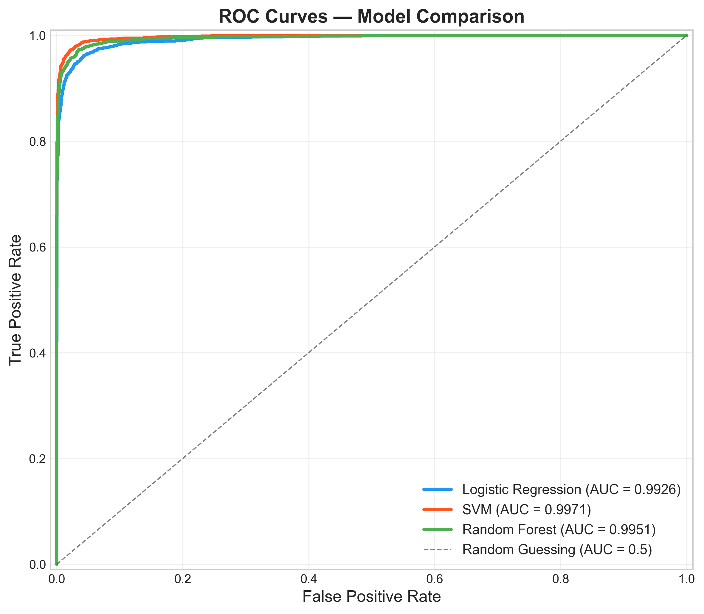
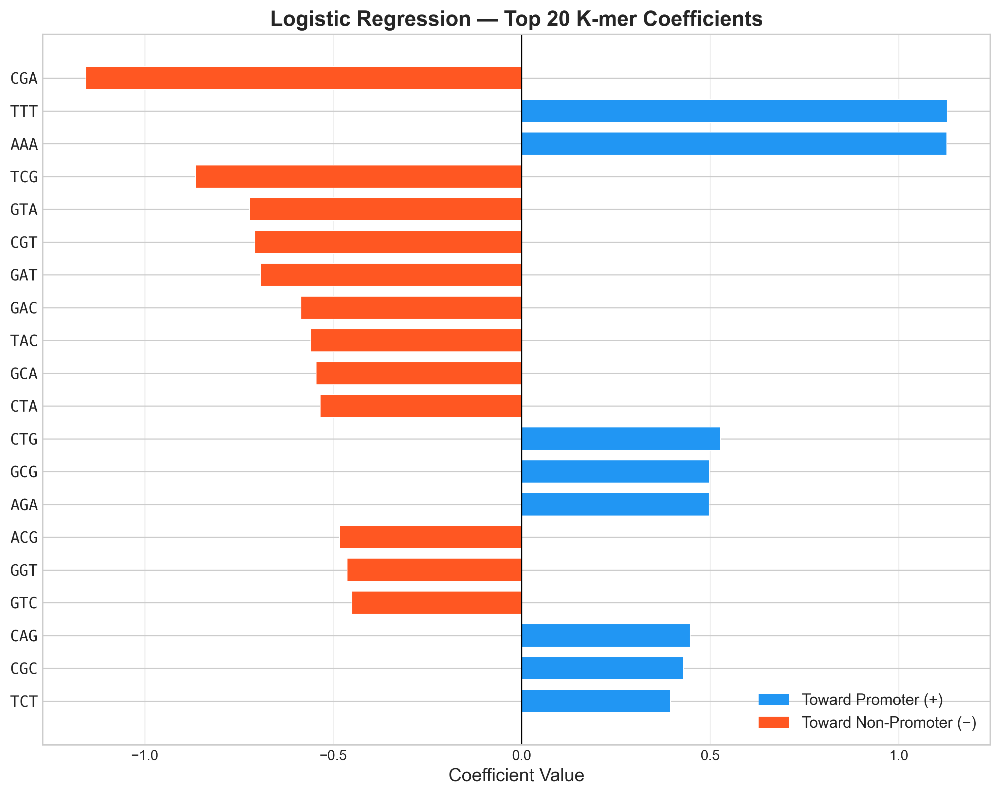

# Human Promoter Classification Using K-mer Encoding and Classical Machine Learning

A computational genomics pipeline that classifies human DNA sequences as promoter or non-promoter regions using k-mer frequency encoding and three machine learning models. Built with real promoter data from the Eukaryotic Promoter Database (EPDnew) and evaluated with a focus on biological interpretability.

---

## Results at a Glance

| Model | Accuracy | Precision | Recall | F1 Score | ROC-AUC |
|-------|----------|-----------|--------|----------|---------|
| Logistic Regression | 0.9582 | 0.9609 | 0.9553 | 0.9581 | 0.9926 |
| **SVM (RBF kernel)** | **0.9745** | **0.9797** | **0.9690** | **0.9743** | **0.9971** |
| Random Forest | 0.9658 | 0.9791 | 0.9520 | 0.9653 | 0.9951 |

SVM with RBF kernel achieved the best performance across all metrics, suggesting that non-linear k-mer interactions contribute to promoter recognition.

<p align="center">
  
</p>

---

## Background

**Promoters** are regions of DNA upstream of genes that serve as binding platforms for the transcriptional machinery. In humans, promoters exhibit two major architectures:

- **TATA-dependent promoters** (~25-30% of human promoters): Contain a TATA box (consensus `TATAAA`) at approximately -30 bp relative to the transcription start site (TSS). These tend to drive tissue-specific gene expression.
- **CpG island promoters** (~70%): Enriched in CG dinucleotides and associated with housekeeping genes expressed across all cell types.

This project encodes DNA sequences as **k-mer frequency vectors** — a bag-of-words representation where each possible subsequence of length *k* is treated as a "word," and its frequency across the sequence becomes a feature. For k=3, this produces 4³ = 64 features per sequence.

Three classifiers spanning a complexity spectrum are compared: Logistic Regression (linear), SVM with RBF kernel (non-linear), and Random Forest (ensemble). Feature importance analysis connects the learned patterns back to known promoter biology.

---

## Key Findings

### Feature Importance

Both Logistic Regression and Random Forest identified **CG-containing k-mers** (ACG, CGA, CGT, TCG, GCG, CCG) as the most discriminating features. This aligns with the central role of CpG dinucleotides in promoter biology.

<p align="center">
  
</p>

An interesting finding: CG-containing k-mers had **negative** coefficients in Logistic Regression (pointing toward non-promoter). This reflects that our synthetic negative sequences — generated by random nucleotide selection — produce CG dinucleotides at the frequency expected from base composition alone. Real genomic DNA, including promoters, has evolutionary CpG depletion due to cytosine methylation and spontaneous deamination. The model is partially learning the distinction between real and synthetic DNA, not purely promoter-specific biology.

**GCG** was a notable exception with a positive coefficient toward promoter, potentially reflecting GC-box motifs (SP1 transcription factor binding sites) that are genuine proximal promoter elements.

**AAA** and **TTT** showed strong positive coefficients toward promoter, consistent with the TATA box and other AT-rich functional elements present in real promoter sequences but absent from structureless random sequences.

### Limitations

The reported performance likely represents an upper bound. The synthetic negative set, while GC-content matched, lacks the complex sequence structure of real genomic DNA (codon usage patterns, repetitive elements, splice site signals). Evaluation against real intergenic sequences would provide a more stringent test of promoter-specific feature learning.

---

## Project Structure

```
promoter-classification/
├── README.md
├── requirements.txt
├── download_data.py            # Data acquisition from EPDnew
├── run_models.py               # Full training and evaluation pipeline
├── run_visualizations.py       # Generate all figures
├── data/
│   ├── raw/                    # Original FASTA files (not tracked by git)
│   ├── processed/              # Encoded feature matrices
│   └── README.md               # Data sources and download instructions
├── src/
│   ├── __init__.py
│   ├── data_loader.py          # FASTA parsing, sequence cleaning, negative generation
│   ├── encoding.py             # K-mer frequency encoding pipeline
│   ├── models.py               # Model training, tuning, evaluation, feature importance
│   └── visualization.py        # All figure generation
├── results/
│   ├── figures/                # Saved plots (PNG + SVG)
│   └── metrics/                # Model performance metrics (JSON + CSV)
└── paper/
    └── promoter_classification.md
```

---

## Methodology

### Data

- **Positive set**: 16,455 experimentally validated human promoter sequences from [EPDnew](https://epd.expasy.org/epd/) (version 6, hg38 assembly). Each sequence spans -249 to +50 bp relative to the TSS (300 bp total).
- **Negative set**: GC-content matched synthetic sequences. For each position, nucleotides are drawn from {G, C} with probability equal to the promoter set's mean GC content, and from {A, T} otherwise. This prevents the model from using nucleotide composition as a classification shortcut.
- **Split**: 80% training / 20% test, stratified by class.

### Feature Encoding

Each 300 bp sequence is converted to a 64-dimensional vector of 3-mer frequencies:

1. Slide a window of size k=3 across the sequence (298 windows per sequence)
2. Count occurrences of each of the 64 possible 3-mers
3. Normalize by total count to obtain frequencies (each vector sums to 1.0)

### Models

| Model | Key Hyperparameters (Tuned via 5-Fold GridSearchCV) |
|-------|-----------------------------------------------------|
| Logistic Regression | C=0.1, L2 penalty, liblinear solver |
| SVM | RBF kernel (best C and gamma determined by grid search) |
| Random Forest | Best n_estimators, max_depth, min_samples_split, max_features determined by grid search |

All models are wrapped in scikit-learn Pipelines with StandardScaler to prevent data leakage during cross-validation.

### Evaluation

Models are evaluated on the held-out test set using accuracy, precision, recall, F1 score, and ROC-AUC. The test set is touched exactly once — all hyperparameter selection is performed via cross-validation on the training set only.

---

## Reproducing Results

### Prerequisites

- Python 3.11+
- conda (recommended) or pip

### Setup

```bash
# Clone the repository
git clone https://github.com/username/promoter-classification.git
cd promoter-classification

# Create and activate environment
conda create -n promoter-clf python=3.11 -y
conda activate promoter-clf

# Install dependencies
pip install -r requirements.txt
```

### Data Acquisition

Download promoter sequences from EPDnew:

1. Go to [EPDnew Select/Download](https://epd.expasy.org/epd/EPDnew_select.php)
2. Select **H. sapiens**, check "most representative promoter per gene"
3. Download as FASTA with range -249 to +50
4. Save to `data/raw/human_promoters.fasta`

Or run the download script (may require manual fallback if EPDnew is unavailable):

```bash
python download_data.py
```

### Run the Pipeline

```bash
# Train and evaluate all models (~15-30 min, SVM is the bottleneck)
python run_models.py

# Generate all figures
python run_visualizations.py
```

Results are saved to `results/metrics/` and `results/figures/`.

---

## Figures

| Figure | Description |
|--------|-------------|
| `roc_curves.png` | ROC curves for all three models overlaid |
| `confusion_matrices.png` | Side-by-side confusion matrices |
| `lr_coefficients.png` | Top 20 logistic regression coefficients with directionality |
| `rf_importance.png` | Top 20 random forest Gini importances |
| `kmer_frequency_comparison.png` | Mean k-mer frequencies: promoter vs non-promoter |
| `model_comparison.png` | Grouped bar chart comparing all metrics |
| `gc_distribution.png` | GC content distributions validating negative set design |

---

## Future Directions

- **Real genomic negatives**: Replace synthetic sequences with intergenic regions from the human genome to test promoter-specific (not real-vs-synthetic) classification
- **Multi-scale k-mer analysis**: Systematically compare k=3, 4, 5, 6 to identify the optimal resolution for capturing promoter motifs
- **Deep learning comparison**: Evaluate CNN and LSTM architectures that preserve positional information lost in k-mer bag-of-words encoding
- **Cross-species generalization**: Train on human promoters and evaluate on mouse or *Drosophila* promoters to assess evolutionary conservation of learned features

---

## Tools and Libraries

- **Python 3.11** — core language
- **scikit-learn** — model training, evaluation, and hyperparameter tuning
- **NumPy** — numerical computation and array operations
- **matplotlib / seaborn** — visualization
- **BioPython** — sequence handling utilities

---

## Data Source

Dreos R, Ambrosini G, Groux R, Cavin Périer R, Bucher P. *EPD and EPDnew, high-quality promoter resources in the next-generation sequencing era.* Nucleic Acids Res. 2013;41(D1):D157-D164. doi: [10.1093/nar/gks1233](https://doi.org/10.1093/nar/gks1233)

---

## Author

**Ayaan Rezwan** — Biomedical Engineering, University of Waterloo

[LinkedIn](https://linkedin.com/in/ayaanrezwan) · [GitHub](https://github.com/ayaanrezwan)
